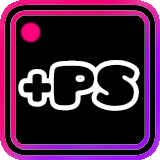

# <span style="color:#FFD700; font-size:2em">Betterpause</span>



---

<div align="center">

<span style="color:#00BFFF; font-size:1.7em"><b>An improved pause experience for Geometry Dash</b></span>

</div>

---

## <span style="color:#FFA500; font-size:1.2em">What is Betterpause?</span>

**Betterpause** is a visual mod that transforms the Geometry Dash pause menu, letting you see essential level information in a clear, customizable, and attractive way.  
Forget boring menus—make your pause more useful and stylish!

---

## <span style="color:#32CD32; font-size:1.2em">Available Statistics</span>

- <span style="color:#FFD700"><b>Attempts</b></span>: How many attempts have you made on the current level?
- <span style="color:#1E90FF"><b>Jumps</b></span>: How many jumps in total?
- <span style="color:#DA70D6"><b>Completions</b></span>: How many times have you beaten this level?
- <span style="color:#FF4500"><b>Objects</b></span>: How many objects are in the level?
- <span style="color:#40E0D0"><b>Device</b></span>: Are you playing on PC or mobile?

---

## <span style="color:#FF69B4; font-size:1.2em">Full Customization</span>

- <span style="color:#00FF7F"><b>Show only what you want</b></span>: Enable or disable each statistic.
- <span style="color:#8A2BE2"><b>Adjustable opacity</b></span>: Make the text more or less transparent as you prefer.
- <span style="color:#FF6347"><b>Statistics size</b></span>: Change the size of the text to fit your screen or preference.

---

## <span style="color:#00FA9A; font-size:1.2em">Why install it?</span>

- <span style="color:#FFD700"><b>Visual improvement</b></span>: A more modern, clear, and attractive pause menu.
- <span style="color:#1E90FF"><b>Instant useful data</b></span>: All the important info, always visible.
- <span style="color:#FF69B4"><b>100% customizable</b></span>: Make it your own. No two pauses are the same!

---

<div align="center">

<span style="color:#00BFFF; font-size:1.3em"><b>Discover a new way to pause in Geometry Dash with Betterpause!</b></span>

</div>

---

## Getting started
We recommend heading over to [the getting started section on our docs](https://docs.geode-sdk.org/getting-started/) for useful info on what to do next.

## Build instructions
For more info, see [our docs](https://docs.geode-sdk.org/getting-started/create-mod#build)
```sh
# Assuming you have the Geode CLI set up already
geode build
```

# Resources
* [Geode SDK Documentation](https://docs.geode-sdk.org/)
* [Geode SDK Source Code](https://github.com/geode-sdk/geode/)
* [Geode CLI](https://github.com/geode-sdk/cli)
* [Bindings](https://github.com/geode-sdk/bindings/)
* [Dev Tools](https://github.com/geode-sdk/DevTools)":)" 
